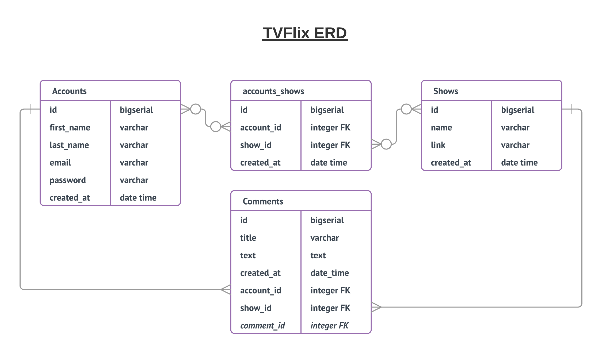
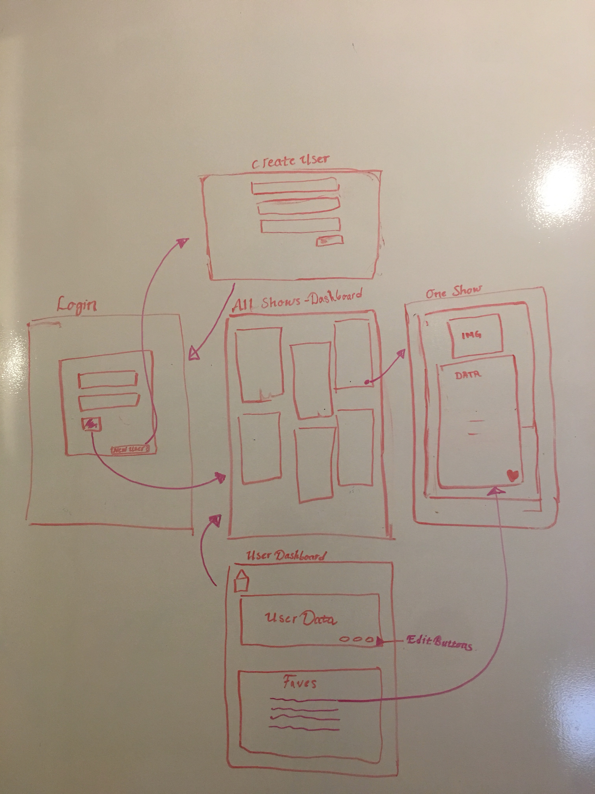
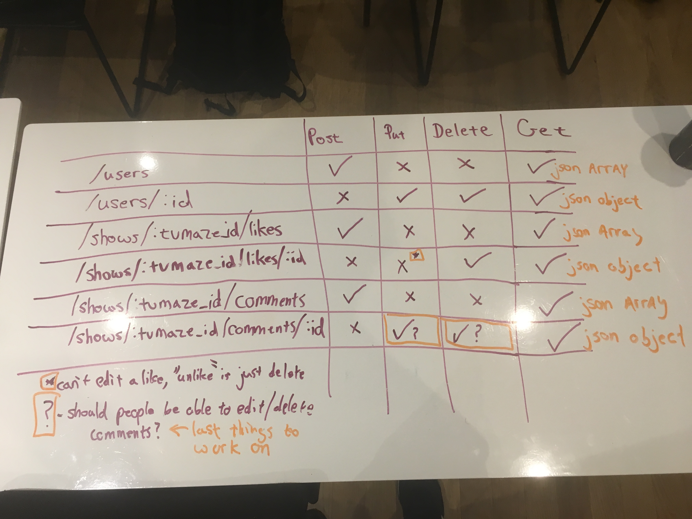

# tvflix
** The TV Show Commenting System for Project Three **

---

## Description

The website will allow the user to make an account and search through shows from a third-party API, and then add these shows to a list of their favorites. All the shows have descriptions as well, so they can discover new programs to watch. They can also comment on shows, and see a list of all their favorites in their profile.

## Getting Started

This is the proposal repository for our project. This project is split into two functional repros: our front-end React application and our back end Express API. These repros can be located:

- **Front**: [https://git.generalassemb.ly/jonnycakes/tvflix-front](https://git.generalassemb.ly/jonnycakes/tvflix-front)
- **Back**: [https://git.generalassemb.ly/jonnycakes/tvflix-back](https://git.generalassemb.ly/jonnycakes/tvflix-back)

---

## Prerequisites

What things you need to install the software and how to install them

```
Give examples
```

### ERD




### Wireframes



### Routes




## User Stories

[User Stories](https://trello.com/b/Jb9dkSaO/user-stories)

---

## Installing


```
git clone
```


```
npm install
```


## Running the tests

* [npm Test](https://docs.npmjs.com/cli/test)
 Users route has been set up to implement unit testing, however only intergration testing has be applied at this time.

## Deployment

https://git.generalassemb.ly/nyc-wdi-palmarius/deployment/blob/master/react_slingshot_heroku.md

## Built With

* [Express](https://expressjs.com/)
* [REACT](https://facebook.github.io/react/) 
* [AXIOS](https://www.npmjs.com/package/axios) 
* [React-Router](https://www.npmjs.com/package/react-router) 


## Authors

* **John Farrely** 
* **Celine Chadwick** 
* **Diane Carlton** 

## Acknowledgments

* Hat tip to anyone who's code was used
* Inspiration
* etc
